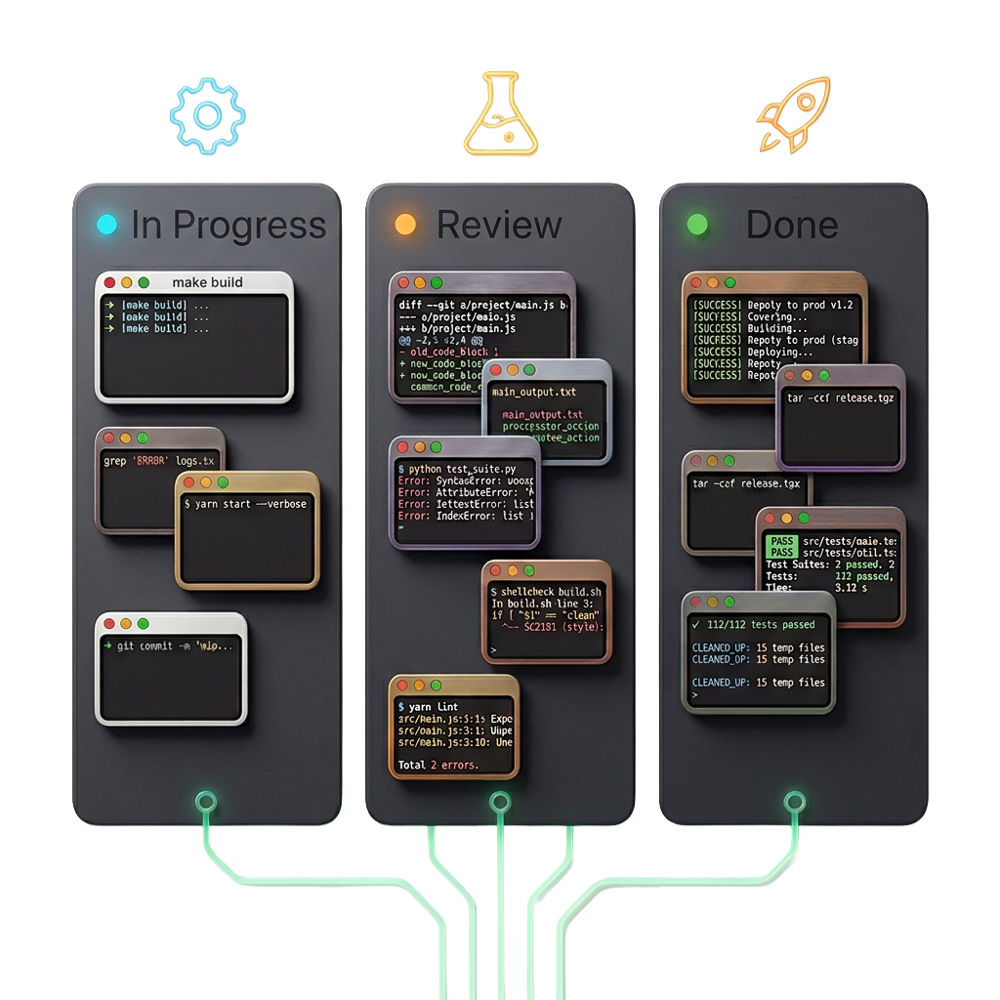
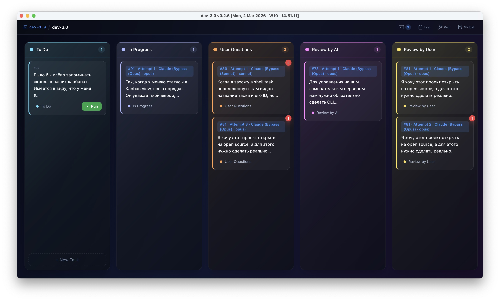
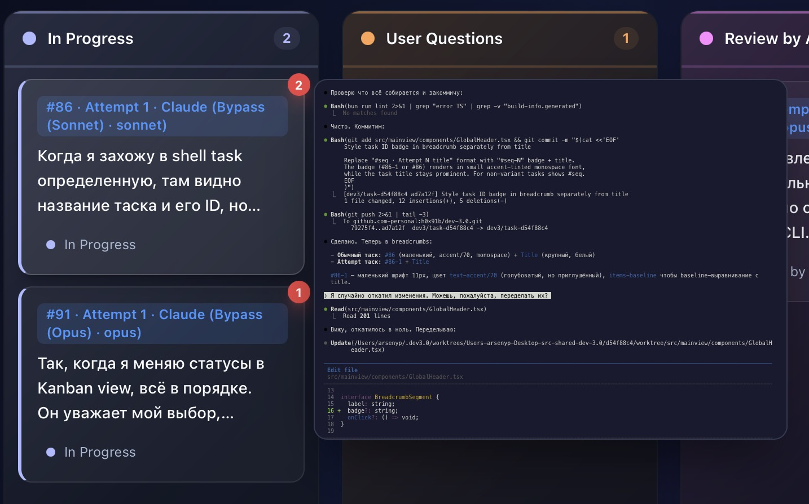
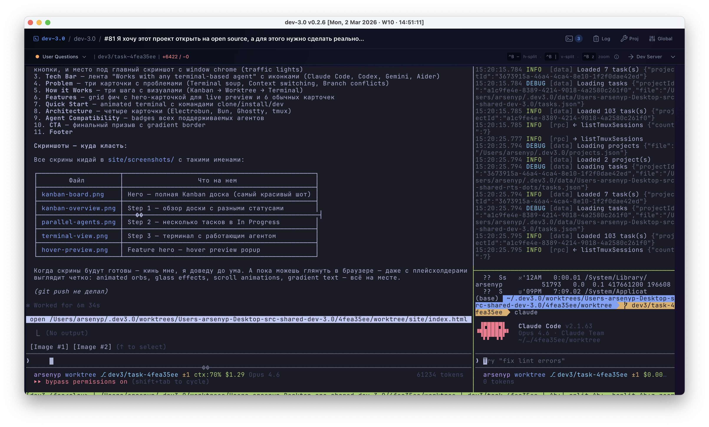

<p align="center">
  
</p>

<h1 align="center">dev-3.0</h1>

<p align="center">
  <strong>Terminal-centric project manager for AI coding agents</strong><br>
  Kanban board meets terminal. Each task gets its own git worktree, tmux session, and full terminal.
</p>

<p align="center">
  <a href="https://github.com/h0x91b/dev-3.0/releases"></a>
  <a href="https://github.com/h0x91b/dev-3.0/stargazers"></a>
  <a href="LICENSE"></a>
</p>

<p align="center">
  <a href="https://h0x91b.github.io/dev-3.0/">Website</a> ·
  <a href="https://github.com/h0x91b/dev-3.0/releases">Download</a> ·
  <a href="https://github.com/h0x91b/dev-3.0/issues">Issues</a>
</p>

---

> [!CAUTION]
> **Task movement is currently MANUAL only.**
> Dragging tasks between Kanban columns (status changes) must be done by hand. Automatic AI-driven task management is planned but **not yet implemented** — this is a work in progress.

<p align="center">
  
</p>

## The problem

You're running 5+ AI agents across different terminals, repos, and branches. Switching context takes forever. You lose track of what's where. Merge conflicts pile up because multiple agents edit the same repo.

## The solution

dev-3.0 gives you a Kanban board where each task is a fully isolated environment:

1. **Create a task** on the board — describe what needs to be done
2. **An isolated git worktree** is created automatically — zero conflicts between parallel agents
3. **A terminal with tmux** launches inside the worktree with your configured command (e.g., `claude`)
4. **See everything at a glance** — hover over any card for a live terminal preview

<p align="center">
  
</p>

## Key features

- **Kanban workflow** — drag tasks between columns (To Do → In Progress → Review → Completed)
- **Git worktree per task** — full repo isolation, no merge conflicts between parallel agents
- **Live terminal preview** — hover any card to see what the agent is doing right now
- **Terminal bell alerts** — red badges on cards when an agent needs your attention
- **Multi-agent attempts** — run the same task with different agents/configs and compare results
- **Automated setup** — configure a setup script per project that runs for every new task
- **Works with any CLI agent** — Claude Code, Codex, Gemini CLI, Aider, or any terminal tool

<p align="center">
  
</p>

## Install

### Homebrew (recommended)

```sh
brew tap h0x91b/dev3
brew install --cask dev3
```

This will also install required dependencies (`git`, `tmux`) if not already present.

```sh
# Update to latest version
brew upgrade --cask dev3

# Uninstall
brew uninstall --cask dev3
```

### Manual download

Download the latest `.dmg` from [**Releases**](https://github.com/h0x91b/dev-3.0/releases), drag to Applications, and run. Make sure `git` and `tmux` are installed.

macOS only for now — Linux and Windows coming soon.

## Tech stack

| Component | Technology |
|---|---|
| Desktop runtime | [Electrobun](https://electrobun.dev) — native macOS webview, no Chromium |
| JS runtime | [Bun](https://bun.sh) |
| Terminal | [ghostty-web](https://github.com/nichochar/ghostty-web) — GPU-accelerated rendering |
| Frontend | React 18, Tailwind CSS, Vite |
| Multiplexer | tmux |

## Development

```bash
bun install
bun run dev          # HMR mode (Vite dev server + Electrobun)
bun run build        # Staging build
bun run build:prod   # Production build
bun run lint         # TypeScript type-check
bun run test         # Run tests
```

See [AGENTS.md](AGENTS.md) for full architecture docs and coding guidelines.

## Star History

[](https://www.star-history.com/?1#h0x91b/dev-3.0&type=date&legend=top-left)

## License

[Apache 2.0](LICENSE) — © 2026 Arseny Pavlenko
